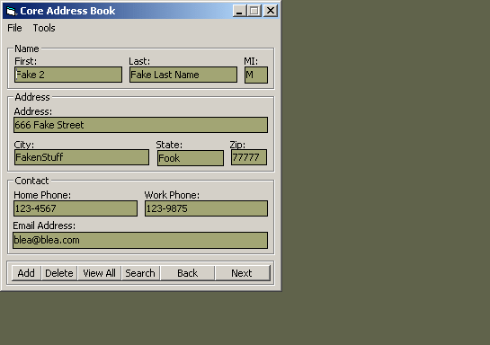



## Address Book Using MSAccess Database

### Description

This is a basic example of how to use an access database in an application.. an address book... It has options like search, add, delete, view all.. again, just an example
 
### More Info
 

             |
---                |---
**Submitted On**   |2002-10-14 20:55:58
**By**             |[Robert Cleaver](https://github.com/Planet-Source-Code/PSCIndex/blob/master/ByAuthor/robert-cleaver.md)
**Level**          |Advanced
**User Rating**    |4.8 (24 globes from 5 users)
**Compatibility**  |VB 6\.0
**Category**       |[Databases/ Data Access/ DAO/ ADO](https://github.com/Planet-Source-Code/PSCIndex/blob/master/ByCategory/databases-data-access-dao-ado__1-6.md)
**World**          |[Visual Basic](https://github.com/Planet-Source-Code/PSCIndex/blob/master/ByWorld/visual-basic.md)
**Archive File**   |[Address\_Bo14622410142002\.zip](https://github.com/Planet-Source-Code/robert-cleaver-address-book-using-msaccess-database__1-39841/archive/master.zip)

